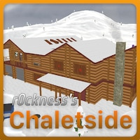
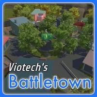

# Intruder Map Recuperation

This guide will show how very old [Intruder](https://intruderfps.com/) maps built with Unity 4 can be ported to work with current Intruder builds. It will go over decompilation and how to fix problems that may arise.

I've ported many maps this way, with the permission of the authors.

  
  
  
  
  
  

## Tool Installation
You need to install [AssetRipper](https://assetripper.github.io/AssetRipper/).

And the Unity Editor version that the latest [IntruderMM](https://sharklootgilt.superbossgames.com/wiki/index.php/IntruderMM) requires. I assume that you are an experienced Intruder mapmaker if you are attempting this.

## Decompile
- Find the `Assembly-CSharp.dll` file of the latest Intruder build and copy it into `/bundle`
  - Windows: `C:\Program Files (x86)\Steam\steamapps\common\Intruder\Data\Managed\Assembly-CSharp.dll`
  - macOS: `~/Library/Application Support/Steam/steamapps/common/Intruder/Intruder.app/Contents/Resources/Data/Managed/Assembly-CSharp.dll`
  - Linux: `~/.local/share/Steam\steamapps\common\Intruder\Data\Managed\Assembly-CSharp.dll`
- Put the `ilfm` or `ilfw` file that you want to decompile in `/bundle`
- Start AssetRipper
- Load the `/bundle` folder in AssetRipper
- Export from AssetRipper to the `/decomp` folder

You should now have 2 new folders inside `/decomp`.

## Fix files
- Download the latest IntruderMM and put it in the root folder, right next to this `rec.sh`
- Run `sh rec.sh`
  - This is a script for macOS and Linux only. If you are on Windows, open the script and run the Windows commands that would do the same job.

This script will try to assign the correct references to mapmaker function. Without it, any and all mapmaker defined things will not work.

## Open in Unity
- Open the `/decomp/ExportedProject` folder in Unity
- If Unity crashes, delete the `/decomp/Exported/ProjectAssets/Level1` folder.
  - This can happen due to old lightmaps that are no longer supported.
- The exported map will be found in `/Assets/Map1.unity`, open it and make sure everything looks ok. It may require quite a lot of changes to reach a playable state.

Create an issue or contact me on Discord if you need help with these steps when porting a map.

### Where to find old maps
The server that hosted the maps prior to the transition to the Steam workshop is still up.

You can use a tool like [Cyberduck](https://cyberduck.io/) and access [https://sbg-web-live-ugc-uploads.s3.us-west-2.amazonaws.com/](https://sbg-web-live-ugc-uploads.s3.us-west-2.amazonaws.com/)

Rob and Austin, if you guys are reading this, please don't delete the maps from this server. They still have use to people like me.
